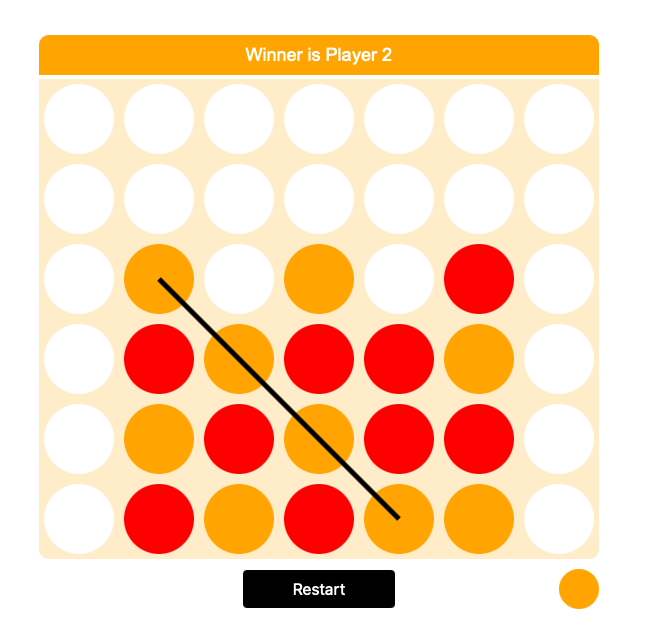

# c4arena 
### a moke-up of the original c4arena game
### <a href='https://ioanniskousis.github.io/c4arena/'>Play the game</a>
 
 

 
 

## About  
The project was assigned to me as a challenge during an interview process, to build it in 1.5 hours and I built the first approach in 2 hours, and completed the final approach in 3 hours.

It is played by 2 players.  
Each player drops balls on a column of their choise trying to setup structures of at least 4 balls in a row, column, or diagonal.

Messages are shown at the top-bar on edge cases and palyers are swapt on game over.

## Technologies used

- HTML5 was used to setup the basic interface skeleton with minimum containers.
- Javascript (ES6) was used to create all the active alements on the load of the page and manage the game logic.
- CSS3 styled the elements
- SVG was used to mark the winning lines

## Contributors

:bust_in_silhouette:
### Ioannis Kousis

- Github: [@ioanniskousis](https://github.com/ioanniskousis)
- Linkedin: [Ioannis Kousis](https://www.linkedin.com/in/jgkousis)
- E-mail: jgkousis@gmail.com
​

